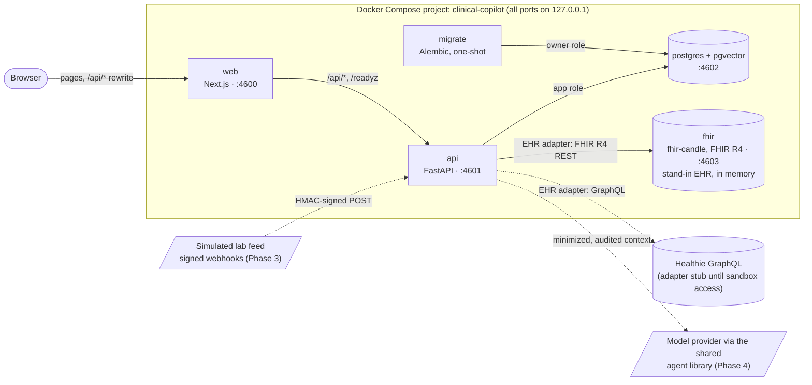
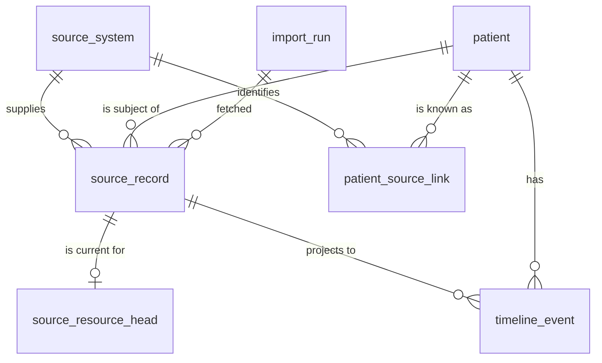

# Architecture

Clinical Copilot is a physician-facing layer over an EHR. It keeps a normalized patient timeline whose every row traces back to the exact source record it came from. Summaries cite those records line by line. Nothing is written back to the EHR until a physician approves it. All data is synthetic.

This page covers what runs, how the parts connect, and the timeline data model. The reasons behind each choice are in [the ADRs](adr/). The security design is in [the threat model](threat-model.md).

## Services



Dashed edges arrive in later phases.

| Service | Role | Host port | Memory limit |
| --- | --- | --- | --- |
| web | Next.js App Router, production build. The only origin the browser talks to; `/api/*` is rewritten to the API, so session cookies stay first-party and no CORS is opened. | 4600 | 384 MiB |
| api | FastAPI. Owns authentication, RBAC, ingestion, normalization, audit logs and, later, model calls. `/healthz` is liveness; `/readyz` checks the database and that the schema is at the expected revision. | 4601 | 256 MiB |
| migrate | Runs `alembic upgrade head` as the database owner, then exits. The API starts only after it succeeds. | none | 256 MiB |
| postgres | Postgres 17 with the pgvector extension. Two roles: the owner runs migrations; the API connects as `copilot_app` with only the grants the migrations give it. | 4602 | 256 MiB |
| fhir | fhir-candle, an in-memory FHIR R4 server at `/fhir/r4`. Plays the practice's EHR, loaded with synthetic patients. Unauthenticated and loopback-only. | 4603 | 768 MiB |

### FHIR server memory

The plan capped HAPI FHIR and measured it, with a gate: switch to a lighter server if idle memory exceeded 1.2 GiB. HAPI idled at 1214 MiB against its 1280 MiB cap and took about 12 minutes to become healthy on a loaded host. fhir-candle idled at 53 MiB and was healthy in 33 seconds, so the stack runs fhir-candle. Details and trade-offs are in [ADR 0002](adr/0002-fhir-server-and-memory-budget.md).

Measured usage after every service reported healthy (`docker stats --no-stream`, empty stores):

MEASUREMENT_TABLE

## Repository layout

```
api/                  FastAPI service (Python 3.12, uv)
  app/
    main.py           app factory, /healthz, /readyz
    config.py         settings from the environment
    db.py             engine, expected schema revision
    timeline/         schema models, canonical hashing, clinical time, snapshot ingestion
    ehr/              adapter interface (ports.py) and the in-memory fake adapter
  migrations/         Alembic revisions
  tests/              unit, database and adapter contract tests
web/                  Next.js shell
db/init/              creates the application database role on first start
docs/                 this page, the threat model, ADRs
evals/                eval runner (placeholder until the summary agent exists)
.github/workflows/    CI and evals
```

## The timeline data model

A summary citation must resolve to the exact record it came from. That has to hold even after the source changes the record, the record is re-imported, or the FHIR server is wiped and reloaded. So the model separates what the source said from what the app shows:



- **`source_record`** is one immutable snapshot per distinct version of a source resource. It holds the provenance tuple (system, resource type, id, version id), the source's update time, the encrypted payload exactly as received, and a SHA-256 over its canonical form. The app role may insert and read, never update or delete.
- **`source_resource_head`** says which snapshot of each resource is current. Every import moves it to the snapshot matching what the source returned this time.
- **`timeline_event`** is the normalized, queryable row: kind, code, value, reference range, clinical time. It is a projection of the current snapshots and can be rebuilt from them at any time.
- **`patient`** holds only a surrogate id, encrypted identifiers, and a blind index for exact-match lookup. `patient_source_link` maps each source's patient id to it.

### Content hash

The hash is SHA-256 over sorted-key JSON with no insignificant whitespace. Number tokens keep their source text, because FHIR `1.0` and `1` state different precision. Metadata the server assigns on every write is removed first: FHIR `meta.versionId`, `meta.lastUpdated` and `meta.source`, and Healthie's `updated_at`.

As a result, reloading identical content into a reset FHIR server creates no new snapshots, even though version ids restart at 1. Uniqueness is on (system, type, id, hash), not on the version id, which a reset server reissues. See [ADR 0003](adr/0003-provenance-snapshots-and-heads.md).

### Import, step by step

1. Recompute the content hash from the payload; refuse the record if it differs from the adapter's.
2. Insert the snapshot. If identical content is already stored, keep the existing snapshot.
3. Upsert the head, with the row locked, to point at that snapshot and record `last_seen_at`.
4. If the head moved, mark the previous snapshot's timeline rows superseded. Then project the new head's rows; rows from an earlier visit to the same snapshot come back as current.

All four steps share one transaction. Content that reverts (A, then B, then A) makes A's original snapshot current again.

### Clinical time

A clinical time is stored with the precision the source gave it:
- An instant becomes a UTC `timestamptz`, with the original text kept.
- A year, month or day stays a calendar `date` with its precision. It never becomes "midnight UTC", which would show it on the previous day in US timezones.

A check constraint ties each precision to its column. Ordering and display use one practice timezone (`CLINIC_TIMEZONE`). See [ADR 0004](adr/0004-clinical-time-and-timezones.md).

## EHR adapters

Every source system sits behind one interface (`api/app/ehr/ports.py`). It lists patients, fetches records changed since a time, fetches an exact record version to re-resolve a citation, writes back an approved summary idempotently, and verifies signed change notifications.

Adapters do transport and identity only; normalizers turn records into timeline rows. A single contract suite (`api/tests/contracts/`) holds every adapter to the same behavior. Phase 1 runs it against an in-memory fake; the FHIR R4 and Healthie adapters join it in Phase 2. See [ADR 0005](adr/0005-ehr-adapter-contract.md).
