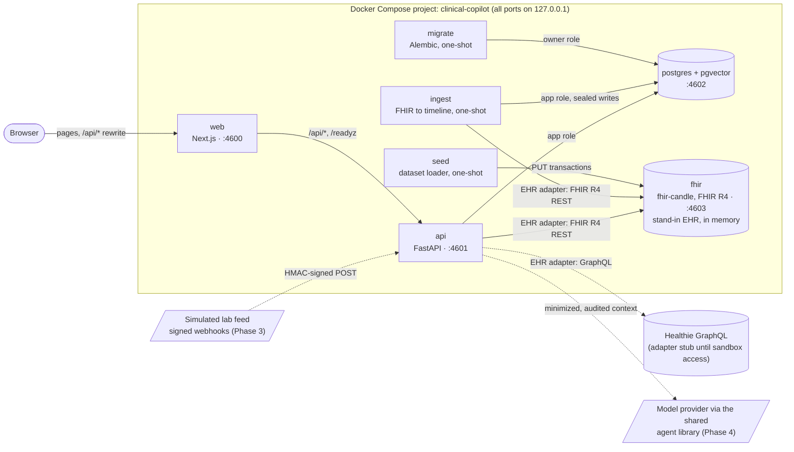
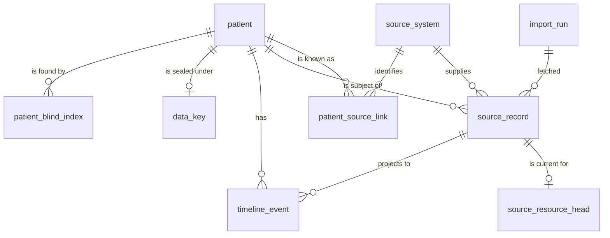
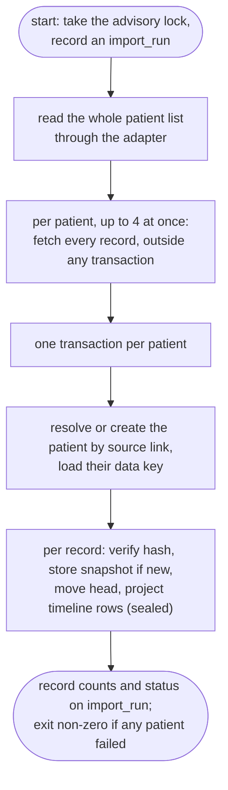

# Architecture

Clinical Copilot is a physician-facing layer over an EHR. It keeps a normalized patient timeline whose every row traces back to the exact source record it came from. Summaries cite those records line by line. Nothing is written back to the EHR until a physician approves it. All data is synthetic.

This page covers what runs, how the parts connect, and the timeline data model. The reasons behind each choice are in [the ADRs](adr/). The security design is in [the threat model](threat-model.md).

## Services



Dashed edges arrive in later phases.

| Service | Role | Host port | Memory limit |
| --- | --- | --- | --- |
| web | Next.js App Router, production build. The only origin the browser talks to; `/api/*` is rewritten to the API, so session cookies stay first-party and no CORS is opened. | 4600 | 384 MiB |
| api | FastAPI. Owns authentication, RBAC, audit logs and, later, model calls. It shares its image with the one-shot services, which run the ingestion and normalization code. `/healthz` is liveness; `/readyz` checks the database and that the schema is at the expected revision. | 4601 | 256 MiB |
| migrate | Runs `alembic upgrade head` as the database owner, then exits. The API starts only after it succeeds. | none | 256 MiB |
| seed | Loads the committed synthetic dataset into the FHIR server, one PUT transaction per patient, then exits. It runs on every start because the server keeps its data in memory, and the API starts only after it finishes. | none | 256 MiB |
| ingest | Reads every patient from the FHIR server through the adapter and, one transaction per patient, stores sealed snapshots and projects the timeline, as the application role. Then exits. Runs after migrate and seed, and the API waits for it. The only service holding the field-encryption keys. | none | 256 MiB |
| postgres | Postgres 17 with the pgvector extension. Two roles: the owner runs migrations; the API connects as `copilot_app` with only the grants the migrations give it. | 4602 | 256 MiB |
| fhir | fhir-candle, an in-memory FHIR R4 server at `/fhir/r4`. Plays the practice's EHR, loaded with synthetic patients. Unauthenticated and loopback-only. | 4603 | 768 MiB |

### FHIR server memory

The plan capped HAPI FHIR and measured it, with a gate: switch to a lighter server if idle memory exceeded 1.2 GiB. HAPI idled at 1214 MiB against its 1280 MiB cap and took about 12 minutes to become healthy on a loaded host. fhir-candle idled at 53 MiB and was healthy in 33 seconds, so the stack runs fhir-candle. Details and trade-offs are in [ADR 0002](adr/0002-fhir-server-and-memory-budget.md).

Measured usage after every service reported healthy (`docker stats --no-stream`, empty stores):

| Service | `docker stats` usage / limit | Anonymous (process) memory |
| --- | --- | --- |
| web | 91 MiB / 384 MiB | 35 MiB |
| api | 69 MiB / 256 MiB | 61 MiB |
| postgres | 33 MiB / 256 MiB | 6 MiB |
| fhir (fhir-candle) | 99 MiB / 768 MiB | 67 MiB |
| **Total** | **292 MiB / 1664 MiB** | **169 MiB** |

Measured 2026-10-02, on a host with load average 12. For comparison, HAPI FHIR alone idled at 1214 MiB anonymous memory under a 1280 MiB cap.

With the dataset loaded (28 patients, 13,994 resources), measured the same way about 20 seconds after the seed finished:

| Service | `docker stats` usage / limit | Anonymous (process) memory |
| --- | --- | --- |
| web | 34 MiB / 384 MiB | 32 MiB |
| api | 62 MiB / 256 MiB | 61 MiB |
| postgres | 30 MiB / 256 MiB | 6 MiB |
| fhir (fhir-candle) | 345 MiB / 768 MiB | 310 MiB |
| **Total** | **471 MiB / 1664 MiB** | **408 MiB** |

Loading the dataset took fhir-candle from 67 MiB of anonymous memory with an empty store (table above) to 310 MiB, so it fits its 768 MiB limit with room to spare. Measured on a host with load average 4 to 5.

Time to a seeded, healthy stack, measured the same day (before the ingest service existed): 46 seconds from an empty database volume with the images already built, seed included. Building both images with no cache took 45 seconds for the API and 96 seconds for the web app, with base images already pulled. A first attempt that built the changed API image under heavier load took 377 seconds end to end; the figures above are the repeatable ones, and pulling base images on a fresh machine is not included in any of them.

With the dataset seeded **and ingested** (12,939 timeline rows), the stack at rest on 2026-10-02 (`docker stats --no-stream`, host load average 5):

| Service | `docker stats` usage / limit |
| --- | --- |
| web | 99 MiB / 384 MiB |
| api | 63 MiB / 256 MiB |
| postgres | 83 MiB / 256 MiB |
| fhir (fhir-candle) | 286 MiB / 768 MiB |
| **Total** | **531 MiB / 1664 MiB** |

During an ingest run, sampled every few seconds: the ingest process used about 83 MiB (106 MiB peak RSS) of its 256 MiB, postgres 96 MiB, and fhir-candle peaked at 511 MiB of 768 MiB while it answered the searches. These are `docker stats` usage figures, not the anonymous-memory figures of the tables above.

Time to a healthy, seeded **and ingested** stack from empty volumes, with the API image already built: 3 min 57 s on a host with load average 12 (seed 10 s, ingest 110 s). Image builds and base-image pulls are not included. From a fresh clone with both images rebuilt (Docker's layer cache warm, base images already pulled), the first `docker compose up -d --wait` took 4 min 53 s at load average 4 and ended healthy with the timeline filled; a cold cache or a first base-image pull would add to that. Ingest timings are in [Ingest, run by run](#ingest-run-by-run) and [ADR 0015](adr/0015-timeline-ingest-and-normalization.md).

## Repository layout

```
api/                  FastAPI service (Python 3.12, uv)
  app/
    main.py           app factory, /healthz, /readyz
    config.py         settings from the environment
    db.py             engine, expected schema revision
    timeline/         schema models, canonical hashing, clinical time, snapshot ingestion,
                      sealed patient identity with blind-index lookup
      normalize/      one normalizer per FHIR resource type and the projector registry
    ingest/           the ingest command (python -m app.ingest)
    ehr/              adapter interface (ports.py), the in-memory fake and the FHIR R4 adapter
    crypto/           field cipher, key wrapping and storage, blind indexes
    fhir_seed/        Synthea bundle transforms and the loader the seed service runs
  migrations/         Alembic revisions
  tests/              unit, database and adapter contract tests; recorded/ holds the offline
                      FHIR fixture and its replay transport
web/                  Next.js shell
db/init/              creates the application database role on first start
data/synthea/         the committed synthetic dataset and the script that regenerates it
docs/                 this page, the threat model, ADRs
evals/                eval runner (placeholder until the summary agent exists)
.github/workflows/    CI and evals
```

## The timeline data model

A summary citation must resolve to the exact record it came from. That has to hold even after the source changes the record, the record is re-imported, or the FHIR server is wiped and reloaded. So the model separates what the source said from what the app shows:



- **`source_record`** is one immutable snapshot per distinct version of a source resource. It holds the provenance tuple (system, resource type, id, version id), the source's update time, the encrypted payload exactly as received, and a SHA-256 over its canonical form. The app role may insert and read, never update or delete.
- **`source_resource_head`** says which snapshot of each resource is current. Every import moves it to the snapshot matching what the source returned this time.
- **`timeline_event`** is the normalized, queryable row: kind, code, value, reference range, clinical time. It is a projection of the current snapshots and can be rebuilt from them at any time.
- **`patient`** holds a surrogate id, a sex-at-birth value, and a sealed name, birth date and identifiers. `patient_blind_index` holds HMAC digests of name tokens, birth date and identifiers for exact-match lookup, and `data_key` holds the patient's data key, wrapped. `patient_source_link` maps each source's patient id to it.

### Content hash

The hash is SHA-256 over sorted-key JSON with no insignificant whitespace. Number tokens keep their source text, because FHIR `1.0` and `1` state different precision. Metadata the server assigns on every write is removed first: FHIR `meta.versionId`, `meta.lastUpdated` and `meta.source`, and Healthie's `updated_at`.

As a result, reloading identical content into a reset FHIR server creates no new snapshots, even though version ids restart at 1. Uniqueness is on (system, type, id, hash), not on the version id, which a reset server reissues. See [ADR 0003](adr/0003-provenance-snapshots-and-heads.md).

### Import, step by step

1. Recompute the content hash from the payload; refuse the record if it differs from the adapter's.
2. Insert the snapshot. If identical content is already stored, keep the existing snapshot.
3. Upsert the head, with the row locked, to point at that snapshot and record `last_seen_at`.
4. If the head moved, mark the previous snapshot's timeline rows superseded. Then project the new head's rows; rows from an earlier visit to the same snapshot come back as current.

All four steps share one transaction. Content that reverts (A, then B, then A) makes A's original snapshot current again.

### Clinical time

A clinical time is stored with the precision the source gave it:
- An instant becomes a UTC `timestamptz`, with the original text kept.
- A year, month or day stays a calendar `date` with its precision. It never becomes "midnight UTC", which would show it on the previous day in US timezones.

A check constraint ties each precision to its column. Ordering and display use one practice timezone (`CLINIC_TIMEZONE`). See [ADR 0004](adr/0004-clinical-time-and-timezones.md).

## EHR adapters

Every source system sits behind one interface (`api/app/ehr/ports.py`). It lists patients, fetches records changed since a time, fetches an exact record version to re-resolve a citation, writes back an approved summary idempotently, and verifies signed change notifications.

Adapters do transport and identity only; normalizers turn records into timeline rows. A single contract suite (`api/tests/contracts/`) holds every adapter to the same behavior. It runs against the in-memory fake and against the FHIR R4 adapter over recorded responses, and, under the `live` marker, against the running stack. The Healthie adapter joins it next. See [ADR 0005](adr/0005-ehr-adapter-contract.md).

The FHIR R4 adapter declares what the local server cannot do: no exact-version reads, no reliable "changed after" query, no write-back and no notifications. A listing reads the full result once and serves its pages from a short-lived snapshot. See [ADR 0013](adr/0013-fhir-seeding-and-adapter-limits.md).

## Seeding and the synthetic dataset

The 28 synthetic patients come from a pinned Synthea run, trimmed to the resource types the product reads, and are committed under `data/synthea/` with the script that regenerates them (`data/synthea/generate.sh --check` confirms the committed files match a fresh run). The seed service rewrites each Synthea bundle to `PUT Type/<id>` entries, loads the shared practitioners and organizations first, then one transaction per patient. See [ADR 0012](adr/0012-synthetic-dataset.md) and [ADR 0013](adr/0013-fhir-seeding-and-adapter-limits.md).

## Ingest, run by run

`python -m app.ingest` (the one-shot `ingest` service) turns what the EHR holds into sealed snapshots and a timeline. Re-running it is safe: it changes nothing but `last_seen_at` on the heads and adds one `import_run` row. The decisions and measurements are in [ADR 0015](adr/0015-timeline-ingest-and-normalization.md).



- **Normalizers** are pure functions from a source record to timeline rows, one per resource type, behind a registry that takes the clinic timezone. Laboratory observations become labs, vital signs become vitals (each component its own row), and the other observation categories produce no rows. Quantities carry a UCUM unit or no number, and times keep the precision the source gave. Patient produces no rows; it feeds the patient's sealed identity.
- **Failure stays local.** A patient whose record cannot be normalized rolls back alone; the others are ingested and the run ends `failed`.
- **Re-runs are no-ops.** The adapter returns everything on every read ([ADR 0013](adr/0013-fhir-seeding-and-adapter-limits.md)), and ingest skips content it has seen by hash, so a run costs reading the source and about five database statements per record: 60 to 79 s for the 28 synthetic patients at concurrency 4, 133 s at concurrency 1, split about evenly between reading and writing. An ingest from empty took 106 to 115 s and was write-bound.
- **A record deleted at the source is not noticed**, because the adapter cannot say what changed and ingest only upserts.

## Field encryption

Patient name, birth date and identifiers are sealed with AES-256-GCM under a per-patient data key, bound to their table, column and row. Data keys are stored wrapped under a key-encryption key that lives outside the database, and patient lookup uses HMAC blind indexes under a separate key. The cipher, key handling and sealed patient identity are built, and the ingest command seals every source payload and the timeline's text and detail columns with the real sealer. `FIELD_KEK` and `BLIND_INDEX_KEY` come from `.env` into the `ingest` service only. A test scans every `_enc` column for each seeded patient's names, birth date and identifiers and finds none. See [ADR 0014](adr/0014-field-encryption-implementation.md) and [ADR 0015](adr/0015-timeline-ingest-and-normalization.md).
